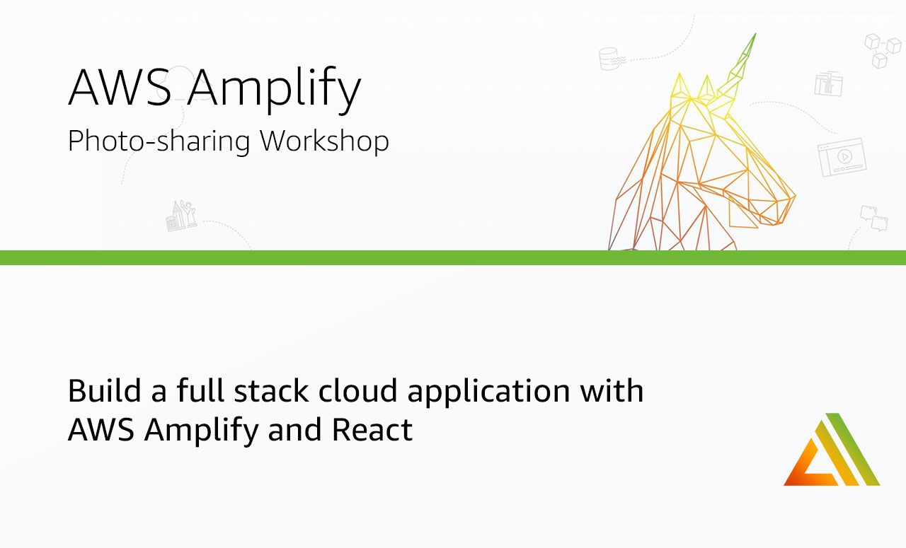

  

    

    

      

        

          

            
              
              <article class="markdown-body entry-content" itemprop="text" id="grip-content">
                # &#10;[](#build-a-photo-sharing-app-with-react-and-aws-amplify)Build a Photo Sharing App with React and AWS Amplify
In this workshop we'll learn how to build a full stack cloud application with React, GraphQL, &amp; [Amplify](https://docs.amplify.aws/).

### &#10;[](#overview)Overview
We'll start from scratch, using the [Create React App CLI](https://reactjs.org/docs/create-a-new-react-app.html#create-react-app) to create a new React web project. We'll then, step by step, use the [Amplify CLI](https://github.com/aws-amplify/amplify-cli) to build out and configure our cloud infrastructure and then use the [Amplify JS Libraries](https://github.com/aws-amplify/amplify-js) to connect the React client application to the APIs we create using the CLI.
The app will be a basic CRUD + List app with real-time updates. When you think of many types of applications like Instagram, Twitter, or Facebook, they consist of a list of items and often the ability to drill down into a single item view. The app we will be building will be very similar to this, displaying a list of posts with images and data like the name, location, and description of the post. You will also be able to see only a view containing only a list of your own posts.
This workshop should take you anywhere between 2 to 5 hours to complete.
### &#10;[](#environment)Environment
Before we begin, make sure you have the following installed:

- Node.js v10.x or later
- npm v5.x or later
- git v2.14.1 or later

We will be working from a terminal using a [Bash shell](https://en.wikipedia.org/wiki/Bash_(Unix_shell)) to run Amplify CLI commands to provision infrastructure and also to run a local version of the React web app and test it in a web browser.
### &#10;[](#background-needed--level)Background needed / level
This workshop is intended for intermediate to advanced front end &amp; back end developers wanting to learn more about full stack serverless development.
While some level of React and GraphQL is helpful, this workshop requires zero previous knowledge about React or GraphQL.
### &#10;[](#topics-well-be-covering)Topics we'll be covering:

- GraphQL API with AWS AppSync
- Authentication
- Object (image) storage
- Authorization
- Hosting
- Deleting the resources

## &#10;[](#getting-started---creating-the-react-application)Getting Started - Creating the React Application
To get started, we first need to create a new React project using the [Create React App CLI](https://github.com/facebook/create-react-app).

<pre>$ npx create-react-app postagram</pre>

Now change into the new app directory &amp; install AWS Amplify, AWS Amplify UI React, react-router-dom, emotion, &amp; uuid:

<pre>$ cd postagram
$ npm install aws-amplify emotion uuid react-router-dom @aws-amplify/ui-react</pre>

## &#10;[](#installing-the-cli--initializing-a-new-aws-amplify-project)Installing the CLI &amp; Initializing a new AWS Amplify Project
### &#10;[](#installing-the-cli)Installing the CLI
Next, we'll install the AWS Amplify CLI:

<pre>$ npm install -g @aws-amplify/cli</pre>

Now we need to configure the CLI with our credentials.
> 
> If you'd like to see a video walkthrough of this configuration process, click [here](https://www.youtube.com/watch?v=fWbM5DLh25U).

<pre>$ amplify configure

- Specify the AWS Region: us-east-1 || us-west-2 || eu-central-1
- Specify the username of the new IAM user: amplify-cli-user
&gt; In the AWS Console, click Next: Permissions, Next: Tags, Next: Review, &amp; Create User to create the new IAM user. Then return to the command line &amp; press Enter.
- Enter the access key of the newly created user:   
? accessKeyId: (&lt;YOUR_ACCESS_KEY_ID&gt;)  
? secretAccessKey: (&lt;YOUR_SECRET_ACCESS_KEY&gt;)
- Profile Name: amplify-cli-user</pre>

### &#10;[](#initializing-a-new-project)Initializing A New Project

<pre>$ amplify init

- Enter a name for the project: postagram
- Enter a name for the environment: dev
- Choose your default editor: Visual Studio Code (or your default editor)
- Please choose the type of app that youre building: javascript
- What javascript framework are you using: react
- Source Directory Path: src
- Distribution Directory Path: build
- Build Command: npm run-script build
- Start Command: npm run-script start
- Do you want to use an AWS profile? Y
- Please choose the profile you want to use: amplify-cli-user</pre>

The Amplify CLI has initialized a new project &amp; you will see a new folder: **amplify** &amp; a new file called `aws-exports.js` in the **src** directory. These files hold your project configuration.
To view the status of the amplify project at any time, you can run the Amplify `status` command:

<pre>$ amplify status</pre>

To view the amplify project in the Amplify console at any time, run the `console` command:

<pre>$ amplify console</pre>

## &#10;[](#adding-an-aws-appsync-graphql-api)Adding an AWS AppSync GraphQL API
To add a GraphQL API, we can use the following command:

<pre>$ amplify add api

? Please select from one of the above mentioned services: GraphQL
? Provide API name: Postagram
? Choose the default authorization type for the API: API key
? Enter a description for the API key: public
? After how many days from now the API key should expire (1-365): 365 (or your preferred expiration)
? Do you want to configure advanced settings for the GraphQL API: No
? Do you have an annotated GraphQL schema? N 
? Choose a schema template: Single object with fields
? Do you want to edit the schema now? (Y/n) Y</pre>

The CLI should open this GraphQL schema in your text editor.
**amplify/backend/api/Postagram/schema.graphql**
Update the schema to the following:

<pre>type Post @model {
  id: ID!
  name: String!
  location: String!
  description: String!
  image: String
}</pre>

After saving the schema, go back to the CLI and press enter.
### &#10;[](#deploying-the-api)Deploying the API
To deploy the API, run the push command:
    $ amplify push
    
    ? Are you sure you want to continue? Y
    
    # You will be walked through the following questions for GraphQL code generation
    ? Do you want to generate code for your newly created GraphQL API? Y
    ? Choose the code generation language target: javascript
    ? Enter the file name pattern of graphql queries, mutations and subscriptions: src/graphql/**/*.js
    ? Do you want to generate/update all possible GraphQL operations - queries, mutations and subscriptions? Yes
    ? Enter maximum statement depth [increase from default if your schema is deeply nested]: 2

> 
> Alternately, you can run `amplify push -y` to answer **Yes** to all questions.

Now the API is live and you can start interacting with it!
### &#10;[](#testing-the-api)Testing the API
To test it out we can use the GraphiQL editor in the AppSync dashboard. To open the AppSync dashboard, run the following command:

<pre>$ amplify console api

&gt; Choose GraphQL</pre>

In the AppSync dashboard, click on **Queries** to open the GraphiQL editor. In the editor, create a new post with the following mutation:

<pre>mutation createPost {
  createPost(input: {
    name: "My first post"
    location: "New York"
    description: "Best burgers in NYC - Jackson Hole"
  }) {
    id
    name
    location
    description
  }
}</pre>

Then, query for the posts:

<pre>query listPosts {
  listPosts {
    items {
      id
      name
      location
      description
    }
  }
}</pre>

### &#10;[](#configuring-the-react-applicaion)Configuring the React applicaion
Now, our API is created &amp; we can test it out in our app!
The first thing we need to do is to configure our React application to be aware of our Amplify project. We can do this by referencing the auto-generated `aws-exports.js` file that is now in our src folder.
To configure the app, open **src/index.js** and add the following code below the last import:

<pre>import Amplify from 'aws-amplify'
import config from './aws-exports'
Amplify.configure(config)</pre>

Now, our app is ready to start using our AWS services.
### &#10;[](#interacting-with-the-graphql-api-from-our-client-application---querying-for-data)Interacting with the GraphQL API from our client application - Querying for data
Now that the GraphQL API is running we can begin interacting with it. The first thing we'll do is perform a query to fetch data from our API.
To do so, we need to define the query, execute the query, store the data in our state, then list the items in our UI.
The main thing to notice in this component is the API call. Take a look at this piece of code:

<pre>/* Call API.graphql, passing in the query that we'd like to execute. */
const postData = await API.graphql({ query: listPosts });</pre>

#### &#10;[](#srcappjs)src/App.js

<pre>// src/App.js
import React, { useState, useEffect } from 'react';

// import API from Amplify library
import { API } from 'aws-amplify'

// import query definition
import { listPosts } from './graphql/queries'

export default function App() {
  const [posts, setPosts] = useState([])
  useEffect(() =&gt; {
    fetchPosts();
  }, []);
  async function fetchPosts() {
    try {
      const postData = await API.graphql({ query: listPosts });
      setPosts(postData.data.listPosts.items)
    } catch (err) {
      console.log({ err })
    }
  }
  return (
    &lt;div&gt;
      &lt;h1&gt;Hello World&lt;/h1&gt;
      {
        posts.map(post =&gt; (
          &lt;div key={post.id}&gt;
            &lt;h3&gt;{post.name}&lt;/h3&gt;
            &lt;p&gt;{post.location}&lt;/p&gt;
          &lt;/div&gt;
        ))
      }
    &lt;/div&gt;
  )
}</pre>

In the above code we are using `API.graphql` to call the GraphQL API, and then taking the result from that API call and storing the data in our state. This should be the list of posts you created via the GraphiQL editor.
Next, test the app:

<pre>$ npm start</pre>

## &#10;[](#adding-authentication)Adding Authentication
Next, let's update the app to add authentication.
To add the authentication service, we can use the following command:

<pre>$ amplify add auth

? Do you want to use default authentication and security configuration? Default configuration 
? How do you want users to be able to sign in when using your Cognito User Pool? Username
? Do you want to configure advanced settings? No, I am done.   </pre>

To deploy the authentication service, you can run the `push` command:

<pre>$ amplify push

? Are you sure you want to continue? Yes</pre>

### &#10;[](#using-the-withauthenticator-component)Using the withAuthenticator component
To add authentication in the React app, we'll go into **src/App.js** and first import the `withAuthenticator` HOC (Higher Order Component) from `@aws-amplify/ui-react`:

<pre>// src/App.js, import the withAuthenticator component
import { withAuthenticator } from '@aws-amplify/ui-react'</pre>

Next, we'll wrap our default export (the App component) with the `withAuthenticator` HOC:

<pre>function App() {/* existing code here, no changes */}

/* src/App.js, change the default export to this: */
export default withAuthenticator(App)</pre>

Next test it out in the browser:

<pre>npm start</pre>

Now, we can run the app and see that an Authentication flow has been added in front of our App component. This flow gives users the ability to sign up &amp; sign in.
Once you sign up, check your email to confirm the sign up.
Now that you have the authentication service created, you can view it any time in the console by running the following command:

<pre>$ amplify console auth

&gt; Choose User Pool</pre>

### &#10;[](#adding-a-sign-out-button)Adding a sign out button
You can also easily add a preconfigured UI component for signing out.

<pre>import { withAuthenticator, AmplifySignOut } from '@aws-amplify/ui-react';

/* Somewhere in the UI */
&lt;AmplifySignOut /&gt;</pre>

### &#10;[](#styling-the-ui-components)Styling the UI components
Next, let's update the UI component styling by setting styles for the `:root` pseudoclass.
To do so, open **src/index.css** and add the following styling:

<pre>:root {
  --amplify-primary-color: #006eff;
  --amplify-primary-tint: #005ed9;
  --amplify-primary-shade: #005ed9;
}</pre>

> 
> To learn more about theming the Amplify React UI components, check out the documentation [here](https://docs.amplify.aws/ui/customization/theming/q/framework/react)

### &#10;[](#accessing-user-data)Accessing User Data
We can access the user's info now that they are signed in by calling `Auth.currentAuthenticatedUser()` in `useEffect`.

<pre>import { API, Auth } from 'aws-amplify'

useEffect(() =&gt; {
  fetchPosts();
  checkUser(); // new function call
});

async function checkUser() {
  const user = await Auth.currentAuthenticatedUser();
  console.log('user: ', user);
  console.log('user attributes: ', user.attributes);
}</pre>

## &#10;[](#image-storage-with-amazon-s3)Image Storage with Amazon S3
The last feature we need to have is image storage. To add image storage, we'll use Amazon S3. Amazon S3 can be configured and created via the Amplify CLI:

<pre>$ amplify add storage

? Please select from one of the below mentioned services: Content
? Please provide a friendly name for your resource that will be used to label this category in the project: images
? Please provide bucket name: postagram14148f2f4aeb4f259c847e1e27145a2 &lt;use_default&gt;
? Who should have access: Auth and guest users
? What kind of access do you want for Authenticated users? create, update, read, delete
? What kind of access do you want for Guest users? read
? Do you want to add a Lambda Trigger for your S3 Bucket? N</pre>

To deploy the service, run the following command:

<pre>$ amplify push</pre>

To save items to S3, we use the `Storage` API. The `Storage` API works like this.

1. Saving an item:

<pre>const file = e.target.files[0];
await Storage.put(file.name, file);</pre>

1. Getting an item:

<pre>const image = await Storage.get('my-image-key.jpg')</pre>

Now we can start saving images to S3 and we can continue building the Photo Sharing App Travel app.
# &#10;[](#photo-sharing-app-travel-app)Photo Sharing App Travel App
Now that we have the services we need, let's continue by building out the front end of the app.
### &#10;[](#creating-the-folder-structure-for-our-app)Creating the folder structure for our app
Next, create the following files in the **src** directory:

<pre>Button.js
CreatePost.js
Header.js
Post.js
Posts.js</pre>

Next, we'll go one by one and update these files with our new code.
### &#10;[](#buttonjs)Button.js
Here, we will create a button that we'll be reusing across the app:

<pre>import React from 'react';
import { css } from 'emotion';

export default function Button({
  title, onClick, type = "action"
}) {
  return (
    &lt;button className={buttonStyle(type)} onClick={onClick}&gt;
      { title }
    &lt;/button&gt;
  )
}

const buttonStyle = type =&gt; css`
  background-color: ${type === "action" ? "black" : "red"};
  height: 40px;
  width: 160px;
  font-weight: 600;
  font-size: 16px;
  color: white;
  outline: none;
  border: none;
  margin-top: 5px;
  cursor: pointer;
  :hover {
    background-color: #363636;
  }
`</pre>

### &#10;[](#headerjs)Header.js
Add the following code in **Header.js**

<pre>import React from 'react';
import { css } from 'emotion';
import { Link } from 'react-router-dom';

export default function Header() {
  return (
    &lt;div className={headerContainer}&gt;
      &lt;h1 className={headerStyle}&gt;Postagram&lt;/h1&gt;
      &lt;Link to="/" className={linkStyle}&gt;All Posts&lt;/Link&gt;
    &lt;/div&gt;
  )
}

const headerContainer = css`
  padding-top: 20px;
`

const headerStyle = css`
  font-size: 40px;
  margin-top: 0px;
`

const linkStyle = css`
  color: black;
  font-weight: bold;
  text-decoration: none;
  margin-right: 10px;
  :hover {
    color: #058aff;
  }
`</pre>

## &#10;[](#postsjs)Posts.js
The next thing we'll do is create the **Posts** component to render a list of posts.
This will go in the main view of the app. The only data from the post that will be rendered in this view is the post name and post image.
The `posts` array will be passed in as a prop to the **Posts** component.

<pre>import React from 'react'
import { css } from 'emotion';
import { Link } from 'react-router-dom';

export default function Posts({
  posts = []
}) {
  return (
    &lt;&gt;
      &lt;h1&gt;Posts&lt;/h1&gt;
      {
        posts.map(post =&gt; (
          &lt;Link to={`/post/${post.id}`} className={linkStyle} key={post.id}&gt;
            &lt;div key={post.id} className={postContainer}&gt;
              &lt;h1 className={postTitleStyle}&gt;{post.name}&lt;/h1&gt;
              &lt;img alt="post" className={imageStyle} src={post.image} /&gt;
            &lt;/div&gt;
          &lt;/Link&gt;
        ))
      }
    &lt;/&gt;
  )
}

const postTitleStyle = css`
  margin: 15px 0px;
  color: #0070f3;
`

const linkStyle = css`
  text-decoration: none;
`

const postContainer = css`
  border-radius: 10px;
  padding: 1px 20px;
  border: 1px solid #ddd;
  margin-bottom: 20px;
  :hover {
    border-color: #0070f3;
  }
`

const imageStyle = css`
  width: 100%;
  max-width: 400px;
`</pre>

## &#10;[](#createpostjs)CreatePost.js
The next component we'll create is `CreatePost`. This component is a form that will be displayed to the user as an `overlay` or a `modal`. In it, the user will be able to toggle the overlay to show and hide it, and also be able to create a new post.
The props this component will receive are the following:

1. 
    `updateOverlayVisibility` - This function will toggle the overlay to show / hide it
1. 
    `updatePosts` - This function will allow us to update the main posts array
1. 
    `posts` - The posts coming back from our API

This component has a lot going on, so before we dive into the code let's walk through what is happening:

1. We create some initial state using the `useState` hook. This state is created using the `initialState` object.
1. The `onChangeText` handler sets the name, description, and location fields of the post
1. The `onChangeImage` handler allows the user to upload an image and saves it to state. It also creates a unique image name.
1. The `save` function does the following:

- First checks to make sure that all of the form fields are populated
- Next it updates the `saving` state to true to show a saving indicator
- We then create a unique ID for the post using the `uuid` library
- Using the form state and the `uuid`, we create a post object that will be sent to the API.
- Next, we upload the image to S3 using `Storage.put`, passing in the image name and the file
- Once the image upload is successful, we create the `post` in our GraphQL API
- Finally, we update the local state, close the popup, and update the local `posts` array with the new post

<pre>import React, { useState } from 'react';
import { css } from 'emotion';
import Button from './Button';
import { v4 as uuid } from 'uuid';
import { Storage, API, Auth } from 'aws-amplify';
import { createPost } from './graphql/mutations';

/* Initial state to hold form input, saving state */
const initialState = {
  name: '',
  description: '',
  image: {},
  file: '',
  location: '',
  saving: false
};

export default function CreatePost({
  updateOverlayVisibility, updatePosts, posts
}) {
  /* 1. Create local state with useState hook */
  const [formState, updateFormState] = useState(initialState)

  /* 2. onChangeText handler updates the form state when a user types into a form field */
  function onChangeText(e) {
    e.persist();
    updateFormState(currentState =&gt; ({ ...currentState, [e.target.name]: e.target.value }));
  }

  /* 3. onChangeFile handler will be fired when a user uploads a file  */
  function onChangeFile(e) {
    e.persist();
    if (! e.target.files[0]) return;
    const image = { fileInfo: e.target.files[0], name: `${e.target.files[0].name}_${uuid()}`}
    updateFormState(currentState =&gt; ({ ...currentState, file: URL.createObjectURL(e.target.files[0]), image }))
  }

  /* 4. Save the post  */
  async function save() {
    try {
      const { name, description, location, image } = formState;
      if (!name || !description || !location || !image.name) return;
      updateFormState(currentState =&gt; ({ ...currentState, saving: true }));
      const postId = uuid();
      const postInfo = { name, description, location, image: formState.image.name, id: postId };

      await Storage.put(formState.image.name, formState.image.fileInfo);
      await API.graphql({
        query: createPost, variables: { input: postInfo }
      });
      updatePosts([...posts, { ...postInfo, image: formState.file }]);
      updateFormState(currentState =&gt; ({ ...currentState, saving: false }));
      updateOverlayVisibility(false);
    } catch (err) {
      console.log('error: ', err);
    }
  }

  return (
    &lt;div className={containerStyle}&gt;
      &lt;input
        placeholder="Post name"
        name="name"
        className={inputStyle}
        onChange={onChangeText}
      /&gt;
      &lt;input
        placeholder="Location"
        name="location"
        className={inputStyle}
        onChange={onChangeText}
      /&gt;
      &lt;input
        placeholder="Description"
        name="description"
        className={inputStyle}
        onChange={onChangeText}
      /&gt;
      &lt;input 
        type="file"
        onChange={onChangeFile}
      /&gt;
      { formState.file &amp;&amp; &lt;img className={imageStyle} alt="preview" src={formState.file} /&gt; }
      &lt;Button title="Create New Post" onClick={save} /&gt;
      &lt;Button type="cancel" title="Cancel" onClick={() =&gt; updateOverlayVisibility(false)} /&gt;
      { formState.saving &amp;&amp; &lt;p className={savingMessageStyle}&gt;Saving post...&lt;/p&gt; }
    &lt;/div&gt;
  )
}

const inputStyle = css`
  margin-bottom: 10px;
  outline: none;
  padding: 7px;
  border: 1px solid #ddd;
  font-size: 16px;
  border-radius: 4px;
`

const imageStyle = css`
  height: 120px;
  margin: 10px 0px;
  object-fit: contain;
`

const containerStyle = css`
  display: flex;
  flex-direction: column;
  width: 400px;
  height: 420px;
  position: fixed;
  left: 0;
  border-radius: 4px;
  top: 0;
  margin-left: calc(50vw - 220px);
  margin-top: calc(50vh - 230px);
  background-color: white;
  border: 1px solid #ddd;
  box-shadow: rgba(0, 0, 0, 0.25) 0px 0.125rem 0.25rem;
  padding: 20px;
`

const savingMessageStyle = css`
  margin-bottom: 0px;
`</pre>

## &#10;[](#postjs)Post.js
The next component that we'll build is the Post component.
In this component, we will be reading the post `id` from the router parameters. We'll then use this post `id` to make an API call to the GraphQL API to fetch the post details.
Another thing to look at is how we deal with images.
When storing an image in S3, we

<pre>import React, { useState, useEffect } from 'react'
import { css } from 'emotion';
import { useParams } from 'react-router-dom';
import { API, Storage } from 'aws-amplify';
import { getPost } from './graphql/queries';

export default function Post() {
  const [loading, updateLoading] = useState(true);
  const [post, updatePost] = useState(null);
  const { id } = useParams()
  useEffect(() =&gt; {
    fetchPost()
  }, [])
  async function fetchPost() {
    try {
      const postData = await API.graphql({
        query: getPost, variables: { id }
      });
      const currentPost = postData.data.getPost
      const image = await Storage.get(currentPost.image);

      currentPost.image = image;
      updatePost(currentPost);
      updateLoading(false);
    } catch (err) {
      console.log('error: ', err)
    }
  }
  if (loading) return &lt;h3&gt;Loading...&lt;/h3&gt;
  console.log('post: ', post)
  return (
    &lt;&gt;
      &lt;h1 className={titleStyle}&gt;{post.name}&lt;/h1&gt;
      &lt;h3 className={locationStyle}&gt;{post.location}&lt;/h3&gt;
      &lt;p&gt;{post.description}&lt;/p&gt;
      &lt;img alt="post" src={post.image} className={imageStyle} /&gt;
    &lt;/&gt;
  )
}

const titleStyle = css`
  margin-bottom: 7px;
`

const locationStyle = css`
  color: #0070f3;
  margin: 0;
`

const imageStyle = css`
  max-width: 500px;
  @media (max-width: 500px) {
    width: 100%;
  }
`</pre>

## &#10;[](#router---appjs)Router - App.js
Next, create the router in App.js. Our app will have two main routes:

1. A home route - `/`. This route will render a list of posts from our API
1. A post details route - `/post/:id`. This route will render a single post and details about that post.

Using React Router, we can read the Post ID from the route and fetch the post associated with it. This is a common pattern in many apps as it makes the link shareable.
Another way to do this would be to have some global state management set up and setting the post ID in the global state. The main drawback of this approach is that the URL cannot be shared.
Other than routing, the main functionality happening in this component is an `API` call to fetch posts from our API.

<pre>import React, { useState, useEffect } from "react";
import {
  HashRouter,
  Switch,
  Route
} from "react-router-dom";
import { withAuthenticator, AmplifySignOut } from '@aws-amplify/ui-react';
import { css } from 'emotion';
import { API, Storage, Auth } from 'aws-amplify';
import { listPosts } from './graphql/queries';

import Posts from './Posts';
import Post from './Post';
import Header from './Header';
import CreatePost from './CreatePost';
import Button from './Button';

function Router() {
  /* create a couple of pieces of initial state */
  const [showOverlay, updateOverlayVisibility] = useState(false);
  const [posts, updatePosts] = useState([]);

  /* fetch posts when component loads */
  useEffect(() =&gt; {
      fetchPosts();
  }, []);
  async function fetchPosts() {
    /* query the API, ask for 100 items */
    let postData = await API.graphql({ query: listPosts, variables: { limit: 100 }});
    let postsArray = postData.data.listPosts.items;
    /* map over the image keys in the posts array, get signed image URLs for each image */
    postsArray = await Promise.all(postsArray.map(async post =&gt; {
      const imageKey = await Storage.get(post.image);
      post.image = imageKey;
      return post;
    }));
    /* update the posts array in the local state */
    setPostState(postsArray);
  }
  async function setPostState(postsArray) {
    updatePosts(postsArray);
  }
  return (
    &lt;&gt;
      &lt;HashRouter&gt;
          &lt;div className={contentStyle}&gt;
            &lt;Header /&gt;
            &lt;hr className={dividerStyle} /&gt;
            &lt;Button title="New Post" onClick={() =&gt; updateOverlayVisibility(true)} /&gt;
            &lt;Switch&gt;
              &lt;Route exact path="/" &gt;
                &lt;Posts posts={posts} /&gt;
              &lt;/Route&gt;
              &lt;Route path="/post/:id" &gt;
                &lt;Post /&gt;
              &lt;/Route&gt;
            &lt;/Switch&gt;
          &lt;/div&gt;
          &lt;AmplifySignOut /&gt;
        &lt;/HashRouter&gt;
        { showOverlay &amp;&amp; (
          &lt;CreatePost
            updateOverlayVisibility={updateOverlayVisibility}
            updatePosts={setPostState}
            posts={posts}
          /&gt;
        )}
    &lt;/&gt;
  );
}

const dividerStyle = css`
  margin-top: 15px;
`

const contentStyle = css`
  min-height: calc(100vh - 45px);
  padding: 0px 40px;
`

export default withAuthenticator(Router);</pre>

### &#10;[](#deleting-the-existing-data)Deleting the existing data
Now the app is ready to test out, but before we do let's delete the existing data in the database. To do so, follow these steps:

1. Open the Amplify Console

<pre>$ amplify console</pre>

1. 
    Click on **API**, then click on **PostTable** under the **Data sources** tab.

1. 
    Click on the **Items** tab.

1. 
    Select the items in the database and delete them by choosing **Delete** from the **Actions** button.

### &#10;[](#testing-the-app)Testing the app
Now we can try everything out. To start the app, run the `start` command:

<pre>$ npm start</pre>

## &#10;[](#hosting)Hosting
The Amplify Console is a hosting service with continuous integration and deployment.
The first thing we need to do is [create a new GitHub repo](https://github.com/new) for this project. Once we've created the repo, we'll copy the URL for the project to the clipboard &amp; initialize git in our local project:

<pre>$ git init

$ git remote add origin git@github.com:username/project-name.git

$ git add .

$ git commit -m 'initial commit'

$ git push origin master</pre>

Next we'll visit the Amplify Console for the app we've already deployed:

<pre>$ amplify console</pre>

In the **Frontend Environments** section, under **Connect a frontend web app** choose **GitHub** then then click on **Connect branch**.
Next, under "Frontend environments", authorize Github as the repository service.
Next, we'll choose the new repository &amp; branch for the project we just created &amp; click **Next**.
In the next screen, we'll create a new role &amp; use this role to allow the Amplify Console to deploy these resources &amp; click **Next**.
Finally, we can click **Save and Deploy** to deploy our application!
Now, we can push updates to Master to update our application.
## &#10;[](#adding-authorization-to-the-graphql-api)Adding Authorization to the GraphQL API
You can update the AppSync API to enable multiple authorization modes.
In this example, we will update the API to use the both Cognito and API Key to enable a combination of public and private access. This will also enable us to implement authorization for the API.
To enable multiple authorization modes, reconfigure the API:

<pre>$ amplify update api

? Please select from one of the below mentioned services: GraphQL   
? Select from the options below: Update auth settings
? Choose the default authorization type for the API: API key
? Enter a description for the API key: public
? After how many days from now the API key should expire (1-365): 365 &lt;or your preferred expiration&gt;
? Configure additional auth types? Y
? Choose the additional authorization types you want to configure for the API: Amazon Cognito User Pool</pre>

Now, update the GraphQL schema to the following:
**amplify/backend/api/Postagram/schema.graphql**

<pre>type Post @model
  @auth(rules: [
    { allow: owner },
    { allow: public, operations: [read] },
    { allow: private, operations: [read] }
  ]) {
  id: ID!
  name: String!
  location: String!
  description: String!
  image: String
  owner: String
}</pre>

Deploy the changes:

<pre>$ amplify push -y</pre>

Now, you will have two types of API access:

1. Private (Cognito) - to create a post, a user must be signed in. Once they have created a post, they can update and delete their own post. They can also read all posts.
1. Public (API key) - Any user, regardless if they are signed in, can query for posts or a single post.

Using this combination, you can easily query for just a single user's posts or for all posts.
To make this secondary private API call from the client, the authorization type needs to be specified in the query or mutation:

<pre>const postData = await API.graphql({
  mutation: createPost,
  authMode: 'AMAZON_COGNITO_USER_POOLS',
  variables: {
    input: postInfo
  }
});</pre>

### &#10;[](#adding-a-new-route-to-view-only-your-own-posts)Adding a new route to view only your own posts
Next we will update the app to create a new route for viewing only the posts that we've created.
To do so, first open **CreatePost.js** and update the `save` mutation with the following to specify the `authmode` and set the owner of the post in the local state:

<pre>async function save() {
  try {
    const { name, description, location, image } = formState;
    if (!name || !description || !location || !image.name) return;
    updateFormState(currentState =&gt; ({ ...currentState, saving: true }));
    const postId = uuid();
    const postInfo = { name, description, location, image: formState.image.name, id: postId };

    await Storage.put(formState.image.name, formState.image.fileInfo);
    await API.graphql({
      query: createPost,
      variables: { input: postInfo },
      authMode: 'AMAZON_COGNITO_USER_POOLS'
    }); // updated
    const { username } = await Auth.currentAuthenticatedUser(); // new
    updatePosts([...posts, { ...postInfo, image: formState.file, owner: username }]); // updated
    updateFormState(currentState =&gt; ({ ...currentState, saving: false }));
    updateOverlayVisibility(false);
  } catch (err) {
    console.log('error: ', err);
  }
}</pre>

Next, open **App.js**.
Create a new piece of state to hold your own posts named `myPosts`:

<pre>const [myPosts, updateMyPosts] = useState([]);</pre>

Next, in the `setPostState` method, update `myPosts` with posts from the signed in user:

<pre>async function setPostState(postsArray) {
  const user = await Auth.currentAuthenticatedUser();
  const myPostData = postsArray.filter(p =&gt; p.owner === user.username);
  updateMyPosts(myPostData);
  updatePosts(postsArray);
}</pre>

Now, add a new route to show your posts:

<pre>&lt;Route exact path="/myposts" &gt;
  &lt;Posts posts={myPosts} /&gt;
&lt;/Route&gt;</pre>

Finally, open **Header.js** and add a link to the new route:

<pre>&lt;Link to="/myposts" className={linkStyle}&gt;My Posts&lt;/Link&gt;</pre>

Next, test it out:

<pre>$ npm start</pre>

## &#10;[](#additional-learning--use-cases)Additional learning &amp; use cases
### &#10;[](#relationships)Relationships
What if we wanted to create a relationship between the Post and another type.
In this example, we add a new `Comment` type and create a relationship using the `@connection` directive. Doing this will enable a one to many relationship between `Post` and `Comment` types.

<pre># amplify/backend/api/Postagram/schema.graphql

type Post @model
  @auth(rules: [
    { allow: owner },
    { allow: public, operations: [read] },
    { allow: private, operations: [read] }
  ]) {
  id: ID!
  name: String!
  location: String!
  description: String!
  image: String
  owner: String
  comments: [Comment] @connection
}

type Comment @model
  @auth(rules: [
    { allow: owner },
    { allow: public, operations: [read] },
    { allow: private, operations: [read] }
  ]) {
  id: ID
  message: String
  owner: String
}</pre>

Now, we can create relationships between posts and comments. Let's test this out with the following operations:

<pre>mutation createPost {
  createPost(input: {
    id: "test-id-post-1"
    name: "Post 1"
    location: "Jamaica"
    description: "Great vacation"
  }) {
    id
    name
    description
  }
}

mutation createComment {
  createComment(input: {
    postCommentsId: "test-id-post-1"
    message: "Great post!"
  }) {
    id message
  }
}

query listPosts {
  listPosts {
    items {
      id
      name
      description
      location
      comments {
        items {
          message
          owner
        }
      }
    }
  }
}</pre>

If you'd like to read more about the `@auth` directive, check out the documentation [here](https://docs.amplify.aws/cli/graphql-transformer/directives#auth).
## &#10;[](#local-mocking)Local mocking
To mock the API, database, and storage locally, you can run the `mock` command:

<pre>$ amplify mock</pre>

## &#10;[](#removing-services)Removing Services
If at any time, or at the end of this workshop, you would like to delete a service from your project &amp; your account, you can do this by running the `amplify remove` command:

<pre>$ amplify remove auth

$ amplify push</pre>

If you are unsure of what services you have enabled at any time, you can run the `amplify status` command:

<pre>$ amplify status</pre>

`amplify status` will give you the list of resources that are currently enabled in your app.
### &#10;[](#deleting-the-amplify-project-and-all-services)Deleting the Amplify project and all services
If you'd like to delete the entire project, you can run the `delete` command:

<pre>$ amplify delete</pre>

              </article>
            

          

        

      

    

  

  
&nbsp;

  

  

